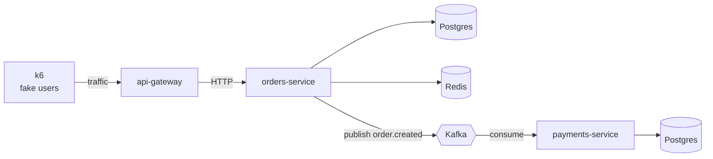

# glassbox

**Make a NestJS system observable.** OpenTelemetry tracing, structured logging and
metrics across three services and a Kafka hop — with real performance bugs planted
on purpose, and a walkthrough of catching each one.

Most observability examples show you a config file and an empty dashboard. This one
gives you a system that is genuinely broken in five instructive ways, and teaches you
to find each break using the tooling.

---

## The story every diagram follows

One user clicks **Buy**. That single request travels:



Three services, because a trace through a single app is a straight line and teaches
you nothing. The interesting question is how `payments-service` knows it belongs to
the same request that started in `api-gateway` — and the Kafka hop is where that gets
hard, because NestJS microservice transports are **not** instrumented for you.

---

## Quick start

Needs Docker and Node 20+.

```bash
npm run setup     # install dependencies, create .env
npm run up        # start Kafka, Postgres, Redis and the LGTM stack
npm run check     # confirm everything is actually reachable
npm run dev       # run all three services with hot reload
```

Then open **http://localhost:3000** for Grafana.

```bash
curl localhost:3001/health/ready
curl -X POST localhost:3001/checkout
```

Other commands: `npm run down`, `npm run reset` (wipes all stored data),
`npm run ps`, `npm run logs`, `npm run build`, `npm run lint`.

---

## What's running

| | URL | What it's for |
|---|---|---|
| **Grafana** | http://localhost:3000 | The screen you actually look at |
| **Kafka UI** | http://localhost:8080 | See messages *and their headers* |
| Prometheus | http://localhost:9090 | Metrics storage |
| Tempo | http://localhost:3200 | Trace storage |
| Loki | http://localhost:3100 | Log storage |
| OTel Collector | localhost:4317 | Where services send telemetry |
| Postgres | localhost:5432 | `orders` and `payments` databases |
| Redis | localhost:6379 | Cache |
| Kafka | localhost:29092 | Broker |
| api-gateway | http://localhost:3001 | Runs on your host |
| orders-service | http://localhost:3002 | Runs on your host |
| payments-service | http://localhost:3003 | Runs on your host |

The services deliberately run on your machine rather than in Docker, so you keep hot
reload and a working debugger.

Grafana is already provisioned with all three datasources **and the links between
them** — click a slow span and jump to that request's log lines, or click a log
line's trace id and jump to the trace.

---

## Build order

Each step runs on its own, so the repo is never in a half-broken state.

| | Step | Status |
|---|---|---|
| 01 | Repo skeleton, infrastructure, health checks | ✅ done |
| 02 | Structured logging with trace ids — Pino vs Winston | next |
| 03 | OpenTelemetry in one service — your first trace | next |
| 04 | Connect the services — HTTP, then the Kafka hop | |
| 05 | Metrics and dashboards — RED + Node runtime | |
| 06 | k6 traffic generator | |
| 07 | The five planted bugs, with write-ups | |
| 08 | Continuous profiling with Pyroscope | |

### The five planted bugs (step 07)

1. **Event loop blocking** — one synchronous call freezes every other request.
   Found with a flamegraph.
2. **N+1 queries** — 51 database round trips instead of 2. Visible as 51 little
   bars in one trace.
3. **Request-scoped providers** — a NestJS trap where `Scope.REQUEST` silently
   makes the whole ancestor chain request-scoped and throughput falls off a cliff.
4. **Broken trace context** — the Kafka hop, before the fix.
5. **Metric cardinality explosion** — a `userId` label takes down Prometheus.

---

## Layout

```
glassbox/
├── services/              # NestJS monorepo
│   ├── apps/
│   │   ├── api-gateway/
│   │   ├── orders-service/
│   │   └── payments-service/
│   └── libs/common/       # shared health module, service identity
├── infra/                 # config for every container
│   ├── otel-collector/
│   ├── tempo/  loki/  prometheus/  grafana/
│   └── postgres/
├── docs/                  # one walkthrough per step
├── load/                  # k6 scenarios (step 6)
├── scripts/check.mjs      # `npm run check`
└── docker-compose.yml
```

---

## Two traps worth knowing before step 3

**OpenTelemetry must start before NestJS does.** The services will launch with
`node --require ./dist/tracing.js`, not with an import at the top of `main.ts`. Get
this wrong and OTel produces zero spans and gives you *no error at all* — just
silence. It is the most common way to lose an evening here.

**Stay on CommonJS.** `services/tsconfig.json` sets `"module": "commonjs"` on
purpose. OTel's automatic instrumentation patches `require()`; switching to ESM
breaks it quietly.

---

## Docs

- [Step 01 — skeleton and infrastructure](docs/step-01-skeleton.md)

## License

MIT
