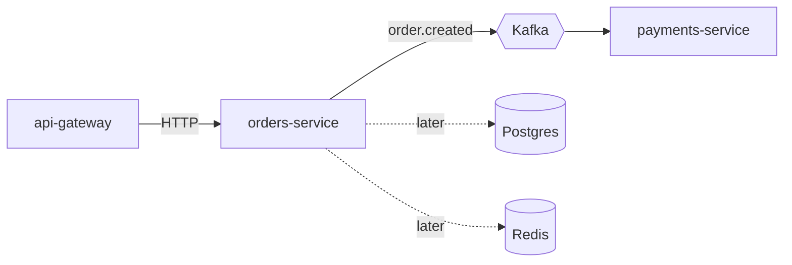

# glassbox

**Watch a NestJS system the way you would in production.**

Three small NestJS services talk over HTTP and Kafka. Every request leaves logs and a
trace. Grafana shows it all in one place.

Later the project will get **five performance bugs, added on purpose**. You find each
one with the tools.


---

## The system


```mermaid
flowchart LR
    GW[api-gateway] -->|HTTP| OR[orders-service]
    OR -->|order.created| KF{{Kafka}}
    KF --> PAY[payments-service]
    OR -.->|later| PG[(Postgres)]
    OR -.->|later| RD[(Redis)]
```

1. `POST /checkout` comes into **api-gateway**. It reserves stock.
2. The gateway calls **orders-service** over HTTP.
3. orders-service sends an `order.created` message to **Kafka** and answers right away.
4. **payments-service** reads the message and charges the order (fake).

All of this is **one trace**, from the first request to the payment.

---

## Start it

You need Docker and Node 20+.

```bash
npm run setup     # install packages, create .env
npm run up        # start the tools in Docker
npm run check     # check that everything answers
npm run dev       # start the three services
```

Other commands: `npm run down` (stop), `npm run reset` (stop and delete all data),
`npm run logs`, `npm run bench:loggers`.

Postman: import [`postman/glassbox.postman_collection.json`](postman/glassbox.postman_collection.json).

---

## Try it

**1. Make a checkout**

```bash
curl -X POST localhost:3001/checkout -H 'content-type: application/json' -d '{"orderId":1}'
```

The answer has a `traceId`. Copy it.

**2. See the trace**

Grafana (http://localhost:3000) → **Explore** → top-left dropdown → **Tempo** →
**TraceQL** → paste the `traceId` → Shift+Enter.

You see all three services in one tree:

```
api-gateway       POST /checkout
  api-gateway       reserve stock          ← our own span
  api-gateway       POST                   ← gateway calls orders
    orders-service    POST /orders
      orders-service    send order.created   ← into Kafka
        payments-service  process order.created   ← out of Kafka
          payments-service  charge card
```

**3. See the logs of that request**

Click any span → **Logs for this span**. Or in Explore → **Loki**:

```logql
{service_name=~".+"} | trace_id="paste-it-here"
```

**4. See the Kafka message**

Kafka UI (http://localhost:8080) → Topics → `order.created` → Messages. Open one
message and look at its **headers**: there is a `traceparent`.

---

## How it works (short)

**Logs.** Every service writes JSON lines to `logs/*.log`. The OTel Collector reads
the files and sends them to Loki. Every line has a `trace_id`.

**Traces.** A *span* is one step of work. A *trace* is all the spans of one request.
OpenTelemetry (OTel) makes most spans by itself. We made two by hand: `reserve stock`
and `charge card`.

**Crossing services.** How does orders-service know it is part of the same trace?
OTel adds a `traceparent` header to the HTTP request. For Kafka, it puts the same
header into the message. The next service reads it and continues the trace.

```
traceparent: 00-43ffd1b608e7117deab953434832c154-a1b2c3d4e5f60718-01
                └──────── trace id ────────────┘ └─ parent span ─┘
```

**Pino vs Winston.** orders-service uses Winston, the others use Pino. Same JSON
shape. Pino is about 2× faster (`npm run bench:loggers`).

---

## What is running

| | URL | What it does |
|---|---|---|
| **Grafana** | http://localhost:3000 | Look at everything here |
| **Kafka UI** | http://localhost:8080 | See Kafka messages |
| Tempo | http://localhost:3200 | Stores traces |
| Loki | http://localhost:3100 | Stores logs |
| Prometheus | http://localhost:9090 | Stores metrics |
| OTel Collector | localhost:4317 / 4318 | Gets all data first, sends it on |
| Kafka | localhost:29092 | Message queue |
| Postgres / Redis | localhost:5432 / 6379 | Not used yet |
| api-gateway | http://localhost:3001 | On your machine, not in Docker |
| orders-service | http://localhost:3002 | On your machine |
| payments-service | http://localhost:3003 | On your machine |

---

## Plan

- [x] **01 Skeleton** — three services, Docker, health checks
- [x] **02 Logs** — JSON logs, Pino vs Winston, logs in Loki
- [x] **03 Traces** — OpenTelemetry, first trace, trace ↔ logs links
- [x] **04 Connect** — gateway → orders (HTTP) → payments (Kafka), one trace
- [ ] **05 Metrics** — request rate, errors, latency, a Grafana dashboard
- [ ] **06 Load** — k6 sends fake traffic
- [ ] **07 Bugs** — save orders in Postgres, use Redis, then add the five bugs
- [ ] **08 Profiling** — see which function uses the CPU

### The five bugs (step 07)

1. **Blocked event loop** — one slow sync call freezes every request.
2. **N+1 queries** — 51 database calls instead of 2.
3. **Request-scoped providers** — `Scope.REQUEST` makes Nest slow.
4. **A broken trace** — the trace stops in the middle. Find where.
5. **Too many metric labels** — a `userId` label takes Prometheus down.

---

## Two traps

**OTel must start first.** `import './tracing'` is the first line of every `main.ts`.
If something is imported before it, you get no traces and no error.

**Keep CommonJS.** OTel works by patching `require()`. With ESM it quietly stops
working.

---

## Layout

```
glassbox/
├── services/            NestJS monorepo
│   ├── apps/            api-gateway, orders-service, payments-service
│   └── libs/common/     health, logging, tracing, kafka
├── infra/               config for every container
├── postman/             all endpoints
└── docker-compose.yml
```

## License

MIT
