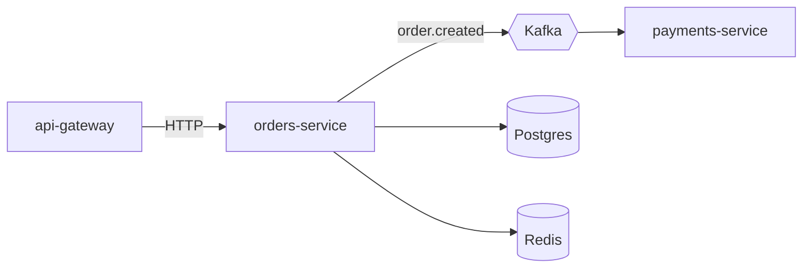

# glassbox

**Watch a NestJS system the way you would in production.**

Three small NestJS services talk over HTTP and Kafka. Every request leaves logs, a
trace and metrics. Grafana shows it all in one place.

Later the project will get **five performance bugs, added on purpose**. You find each
one with the tools.


---

## The system


```mermaid
flowchart LR
    GW[api-gateway] -->|HTTP| OR[orders-service]
    OR -->|order.created| KF{{Kafka}}
    KF --> PAY[payments-service]
    OR --> PG[(Postgres)]
    OR --> RD[(Redis)]
```

1. `POST /checkout` comes into **api-gateway**. It reserves stock.
2. The gateway calls **orders-service** over HTTP.
3. orders-service reads the products (from **Redis**, or **Postgres** if Redis doesn't
   have them) and saves the order in **Postgres**.
4. orders-service sends an `order.created` message to **Kafka** and answers right away.
5. **payments-service** reads the message and charges the order (fake).

All of this is **one trace**, from the first request to the payment.

---

## Start it

You need Docker and Node 20+.

```bash
npm run setup     # install packages, create .env
npm run up        # start the tools in Docker
npm run check     # check that everything answers
npm run dev       # start the three services
```

Other commands: `npm run down` (stop), `npm run reset` (stop and delete all data),
`npm run logs`, `npm run load`, `npm run bench:loggers`.

Postman: import [`postman/glassbox.postman_collection.json`](postman/glassbox.postman_collection.json).

---

## Try it

**1. Make a checkout**

```bash
curl -X POST localhost:3001/checkout -H 'content-type: application/json' -d '{"items":[{"productId":3,"quantity":2}]}'
```

The answer has a `traceId`. Copy it.

**2. See the trace**

Grafana (http://localhost:3000) → **Explore** → top-left dropdown → **Tempo** →
**TraceQL** → paste the `traceId` → Shift+Enter.

You see all three services in one tree:

```
api-gateway       POST /checkout
  api-gateway       reserve stock          ← our own span
  api-gateway       POST                   ← gateway calls orders
    orders-service    POST /orders
      orders-service    get                  ← Redis: products in the cache?
      orders-service    pg.query:INSERT      ← Postgres: save the order
      orders-service    send order.created   ← into Kafka
        payments-service  process order.created   ← out of Kafka
          payments-service  charge card
```

**3. See the logs of that request**

Click any span → **Logs for this span**. Or in Explore → **Loki**:

```logql
{service_name=~".+"} | trace_id="paste-it-here"
```

**4. See the Kafka message**

Kafka UI (http://localhost:8080) → Topics → `order.created` → Messages. Open one
message and look at its **headers**: there is a `traceparent`.

**5. See the dashboard**

Send fake traffic with k6 (runs in Docker, takes 2 minutes):

```bash
npm run load
```

20 fake users do checkouts at the same time. The script is
[`load/checkout.js`](load/checkout.js). At the end, k6 prints a summary: how many
requests, how fast (p95), how many errors.

While it runs, open Grafana → **Dashboards** → Glassbox → **Glassbox — Services**. You
see requests per second, status codes, latency, event loop delay, Kafka messages and
memory.

---

## How it works

**Logs.** Every service writes JSON lines to `logs/*.log`. The OTel Collector reads
the files and sends them to Loki. Every line has a `trace_id`.

**Traces.** A *span* is one step of work. A *trace* is all the spans of one request.
OpenTelemetry (OTel) makes most spans by itself. We made two by hand: `reserve stock`
and `charge card`.

**Crossing services.** How does orders-service know it is part of the same trace?
OTel adds a `traceparent` header to the HTTP request. For Kafka, it puts the same
header into the message. The next service reads it and continues the trace.

```
traceparent: 00-43ffd1b608e7117deab953434832c154-a1b2c3d4e5f60718-01
                └──────── trace id ────────────┘ └─ parent span ─┘
```

**Metrics.** Numbers over time, like "requests per second". OTel makes most of them by
itself: HTTP, Kafka, event loop, memory. We made one by hand: `payments_processed_total`.
The apps send metrics to the Collector every 10 s. Prometheus reads them from there.

**Pino vs Winston.** orders-service uses Winston, the others use Pino. Same JSON
shape. Pino is about 2× faster (`npm run bench:loggers`).

---

## What is running

| | URL | What it does |
|---|---|---|
| **Grafana** | http://localhost:3000 | Look at everything here |
| **Kafka UI** | http://localhost:8080 | See Kafka messages |
| Tempo | http://localhost:3200 | Stores traces |
| Loki | http://localhost:3100 | Stores logs |
| Prometheus | http://localhost:9090 | Stores metrics |
| OTel Collector | localhost:4317 / 4318 | Gets all data first, sends it on |
| Kafka | localhost:29092 | Message queue |
| Postgres | localhost:5432 | Orders and products |
| Redis | localhost:6379 | Cache for products |
| api-gateway | http://localhost:3001 | On your machine, not in Docker |
| orders-service | http://localhost:3002 | On your machine |
| payments-service | http://localhost:3003 | On your machine |

---

## Plan

- [x] **01 Skeleton** — three services, Docker, health checks
- [x] **02 Logs** — JSON logs, Pino vs Winston, logs in Loki
- [x] **03 Traces** — OpenTelemetry, first trace, trace ↔ logs links
- [x] **04 Connect** — gateway → orders (HTTP) → payments (Kafka), one trace
- [x] **05 Metrics** — request rate, errors, latency, a Grafana dashboard
- [x] **06 Load** — k6 sends fake traffic
- [ ] **07 Bugs**
  - [x] orders saved in Postgres, products cached in Redis
  - [x] bug 1: blocked event loop
  - [ ] bugs 2–5
- [ ] **08 Profiling** — see which function uses the CPU

---

## Bug hunt

The project has bugs **added on purpose**, so you can practise finding them. All are
off by default.

**How to play**

1. Run `npm run load` with no bugs. Write down p95. (Healthy: about **120 ms**.)
2. Turn a bug on in `.env`, for example `BUGS=event-loop`. Restart `npm run dev`.
3. Run `npm run load` again. Something is worse.
4. Find the cause with Grafana, **before** you open the answer.
5. Set `BUGS=` back to empty and restart.

| # | `BUGS=` | Status |
|---|---|---|
| 1 | `event-loop` | ready |
| 2 | `n-plus-one` | coming |
| 3 | `request-scope` | coming |
| 4 | `broken-trace` | coming |
| 5 | `labels` | coming |

### Bug 1 — `event-loop`

**Symptom:** checkout gets slow under load. k6 fails the p95 limit.

**Hints:**
- Dashboard → **Event loop delay**. What happens to `api-gateway`?
- Time a request that does nothing: `curl -w "%{time_total}\n" localhost:3001/health/live`
  during `npm run load`. Why is it slow?
- Open a slow checkout trace. Is there time that **no span** explains?

<details>
<summary>Answer</summary>

`receiptCode()` in `api-gateway/src/checkout.service.ts` uses `pbkdf2Sync`. A `Sync`
function runs on the main thread. For about 40 ms, Node can do **nothing else**: no
other request, not even `/health/live`.

The fix is the async version, `pbkdf2`. It runs on a worker thread, so Node keeps
serving other requests while it waits.

What we measured (20 users):

| | healthy | bug on |
|---|---|---|
| checkout p95 | 120 ms | 467 ms |
| `/health/live` p50 | 1.3 ms | 41 ms |
| `/health/live` max | 5 ms | 509 ms |
| event loop delay (max p99) | 11 ms | 407 ms |

**The lesson:** waiting (`await`) is fine. Blocking (`...Sync`, big loops, huge
`JSON.parse`) freezes **every** request, not only the slow one.

</details>

## Two traps

**OTel must start first.** `import './otel'` is the first line of every `main.ts`.
If something is imported before it, you get no traces and no error.

**Keep CommonJS.** OTel works by patching `require()`. With ESM it quietly stops
working.

---

## Layout

```
glassbox/
├── services/            NestJS monorepo
│   ├── apps/            api-gateway, orders-service, payments-service
│   └── libs/common/     health, logging, otel, kafka
├── infra/               config for every container
│   └── grafana/dashboards/   the dashboard (JSON)
├── load/                k6 load test
├── postman/             all endpoints
└── docker-compose.yml
```

## License

MIT
