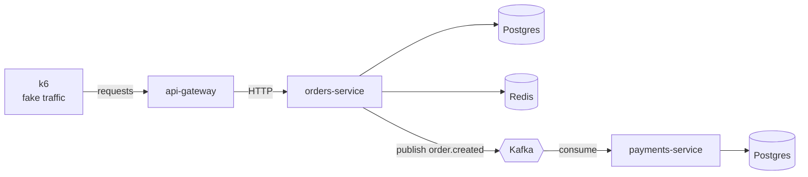

# glassbox

**Learn how to watch a NestJS system in production.**

Three small services, a Kafka queue, and the full set of tools: OpenTelemetry for
tracing, Prometheus for metrics, Loki for logs, Grafana to look at it all.

Later the project will contain **five performance bugs added on purpose**. You find
each one with the tools. That is the point — not the config files, but learning to
read what they tell you.

---

## The system

One user clicks **Buy**. The request goes like this:


```mermaid
flowchart LR
    k6[k6<br/>fake traffic] -->|requests| GW[api-gateway]
    GW -->|HTTP| OR[orders-service]
    OR --> PG[(Postgres)]
    OR --> RD[(Redis)]
    OR -->|publish order.created| KF{{Kafka}}
    KF -->|consume| PAY[payments-service]
    PAY --> PG2[(Postgres)]
```

Why three services and not one? Because with one service there is nothing to learn.
The hard question is how `payments-service` knows it is part of the same request that
started in `api-gateway`.

Over HTTP that works by itself. Through Kafka it does not. NestJS does not pass the
trace id into Kafka messages, so you have to do it yourself. That is the most useful
part of this repo.

---

## Start it

You need Docker and Node 20 or newer.

```bash
npm run setup     # install packages, create .env
npm run up        # start the tools in Docker
npm run check     # test that everything answers
npm run dev       # start the three services
```

Open Grafana at **http://localhost:3000**.

Try it:

```bash
curl localhost:3001/health/ready
curl -X POST localhost:3001/checkout -H 'content-type: application/json' -d '{"orderId":1}'
```

Other commands: `npm run down` (stop), `npm run reset` (stop and delete all data),
`npm run ps`, `npm run logs`, `npm run build`, `npm run lint`.

Prefer a GUI? Import [`postman/glassbox.postman_collection.json`](postman/).

---

## What is running

| | URL | What it does |
|---|---|---|
| **Grafana** | http://localhost:3000 | The page you look at |
| **Kafka UI** | http://localhost:8080 | See messages and their headers |
| Prometheus | http://localhost:9090 | Stores metrics (numbers over time) |
| Tempo | http://localhost:3200 | Stores traces (the path of one request) |
| Loki | http://localhost:3100 | Stores logs |
| OTel Collector | localhost:4317 | Services send all data here first |
| Postgres | localhost:5432 | Two databases: `orders` and `payments` |
| Redis | localhost:6379 | Cache |
| Kafka | localhost:29092 | The message queue |
| api-gateway | http://localhost:3001 | Runs on your machine, not in Docker |
| orders-service | http://localhost:3002 | Runs on your machine |
| payments-service | http://localhost:3003 | Runs on your machine |

The services run on your machine on purpose, so you keep hot reload and a debugger.

Grafana already knows about all three storage tools, **and about the links between
them**. Click a slow step in a trace and jump to that request's log lines.

---

## Build order

Each step works on its own, so the project is never half broken.

| | Step | |
|---|---|---|
| 01 | Project skeleton, Docker, health checks | done |
| 02 | JSON logs, request ids, Pino vs Winston | done |
| 03 | OpenTelemetry — your first trace | next |
| 04 | Connect the services — HTTP, then Kafka | |
| 05 | Metrics and dashboards | |
| 06 | k6 — a tool that makes fake traffic | |
| 07 | The five bugs, with a guide for each | |
| 08 | Profiling — find which function uses the CPU | |

### The five bugs (step 07)

1. **Blocking the event loop** — one slow synchronous call freezes every other
   request. Found with a flamegraph. This is the classic Node.js production problem.
2. **N+1 queries** — 51 database calls instead of 2. In a trace you see 51 small bars
   in a row.
3. **Request-scoped providers** — a NestJS trap. `Scope.REQUEST` quietly makes
   everything above it rebuild on every request, and throughput drops hard.
4. **A broken trace** — the Kafka hop, before the fix.
5. **Too many metric labels** — a `userId` label creates millions of time series and
   takes Prometheus down.

---

## Pino vs Winston

`orders-service` uses Winston. The other two use Pino. Both write **identical JSON**,
so one Loki query finds logs from all three.

200,000 lines written to a file — `npm run bench:loggers`:

| logger | lines/sec | relative |
|---|---|---|
| **pino** | 230,427 | 1.00× |
| winston | 101,741 | **2.27×** slower |

Pino is about 2.2× faster. Both write over 100,000 lines a second, which is far more
than most services need. Useful to know the real number instead of the folklore.

---

## Layout

```
glassbox/
├── services/              # NestJS monorepo
│   ├── apps/
│   │   ├── api-gateway/
│   │   ├── orders-service/
│   │   └── payments-service/
│   └── libs/common/       # health checks, logging
├── infra/                 # config for every container
├── docs/                  # one guide per step
├── postman/               # all endpoints, ready to import
├── scripts/check.mjs      # npm run check
└── docker-compose.yml
```

---

## Two traps worth knowing

**OpenTelemetry must start before NestJS.** From step 3 the services start with
`node --require ./dist/tracing.js`, not with an import at the top of `main.ts`. If you
get this wrong, OTel makes no traces and shows **no error** — only silence.

**Keep CommonJS.** `services/tsconfig.json` sets `"module": "commonjs"` on purpose.
OTel's automatic instrumentation works by patching `require()`. Switching to ESM
breaks it quietly.

---

## Guides

- [Step 01 — skeleton and infrastructure](docs/step-01-skeleton.md)
- [Step 02 — structured logging](docs/step-02-logging.md)

## License

MIT
