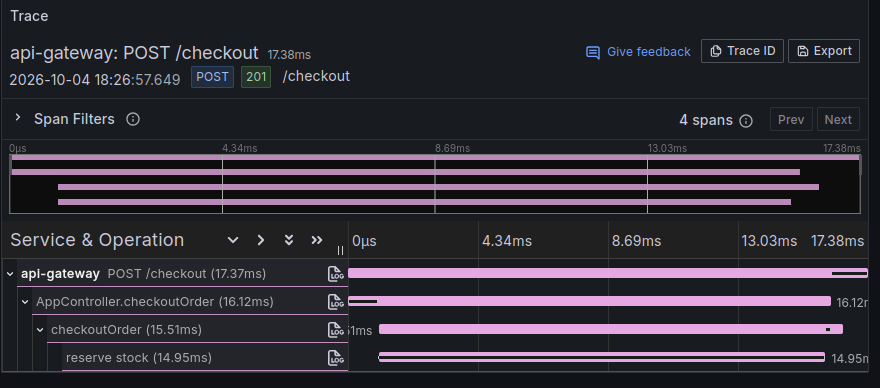

# Step 03 — Tracing with OpenTelemetry

**Goal:** see your first trace in Grafana, and jump from a trace to its logs.

---

## Two words

**Span** — one piece of work, with a start and an end. "Handle POST /checkout" is a
span. "Reserve stock" is a span.

**Trace** — all the spans of one request, as a tree. It shows which step took the
time.

```
POST /checkout                 19.0 ms   ← automatic
   AppController.checkoutOrder 16.8 ms   ← automatic
      checkoutOrder            15.9 ms   ← automatic
         reserve stock         15.1 ms   ← our own (manual) span
```

Here you can see that almost all the time is spent in `reserve stock`.

This is the same trace in Grafana:



---

## What we added

### 1. OpenTelemetry starts in every app

[`libs/common/src/tracing/start-tracing.ts`](../services/libs/common/src/tracing/start-tracing.ts)
starts OpenTelemetry (OTel). It sends spans to the OTel Collector, which sends them to
Tempo.

Most spans are **automatic**. OTel wraps Node's `http`, Express and Nest, so every
request becomes a span without extra code.

### 2. It must start first

OTel works by replacing modules like `http` with versions that record spans. It can
only do this **before** those modules are loaded.

So the first line of every `main.ts` is:

```ts
import './tracing';
```

If something is imported before it, you get **no spans and no error**. Only silence.

For the same reason, `tracing.ts` imports `start-tracing` directly, not from
`@app/common`. Importing `@app/common` would load Nest too early.

### 3. Our own span

OTel does not know about our own code. In
[`checkout.service.ts`](../services/apps/api-gateway/src/checkout.service.ts) we make a
span by hand:

```ts
return tracer.startActiveSpan('reserve stock', async (span) => {
  span.setAttribute('order.id', orderId);   // extra info, visible in Grafana
  // ... the work ...
  span.end();                               // don't forget this
});
```

### 4. `trace_id` on every log line

Pino and Winston now add `trace_id` and `span_id` to every line. We wrote no code for
this — OTel's Pino and Winston plugins do it.

So a log line and a trace can be linked. In Grafana you click from one to the other.

### 5. Less noise

The first version made **21 spans** for one request. 17 of them were Express internals,
like `middleware - jsonParser` and `request handler - /{*path}`.

We changed the settings in `start-tracing.ts`:

- Express plugin: no span per middleware, but it still names the request
  `POST /checkout`
- Router plugin: off
- File, DNS and network plugins: off
- Health checks: not traced

Result: **4 spans**, and each one means something.

---

## Test it

**1. Start everything**

```bash
npm run up
npm run check
npm run dev        # in a second terminal
```

**2. Make a request**

```bash
curl -X POST localhost:3001/checkout -H 'content-type: application/json' -d '{"orderId":1}'
```

The response now has a `traceId`:

```json
{"status":"stub","requestId":"a1ae...","traceId":"895f8add129179bbee07d6eb300d4999",...}
```

**3. See the trace**

1. Open http://localhost:3000
2. Left menu → **Explore**
3. Top dropdown → **Tempo**
4. Choose **TraceQL**, paste the `traceId`, press **Shift+Enter**

You see the tree of 4 spans. Click `reserve stock` to see its `order.id`.

Or search instead of pasting: choose **Search**, set **Service Name** to
`api-gateway`, and run it.

**4. Jump from the trace to its logs**

Click a span → **Logs for this span**. Grafana opens Loki with this query:

```logql
{service_name="api-gateway"} | trace_id="895f8add129179bbee07d6eb300d4999"
```

You see the 5 log lines of that request.

**5. Jump from a log line to its trace**

In Explore → Loki, run `{service_name="api-gateway"}`, click a line, and click the
**View trace** button next to `trace_id`.

**6. Check Winston too**

```bash
curl -X POST localhost:3002/orders
tail -1 logs/orders-service.log
```

The line has `trace_id` and `span_id`, same as Pino.

---

## `req_id` and `trace_id`

Now every log line has two ids:

| | Made by | Works across services? |
|---|---|---|
| `req_id` | us (step 2) | No — we must copy it by hand |
| `trace_id` | OpenTelemetry | Yes — over HTTP it travels by itself |

Right now each trace stays inside one service, because the services do not call each
other yet. Step 4 connects them, and that is where `trace_id` shows its real value.

---

## Next

**Step 04 — connect the services.** The gateway calls orders over HTTP (the trace
continues by itself), then orders sends a message through Kafka (it does not — we fix
that by hand).
